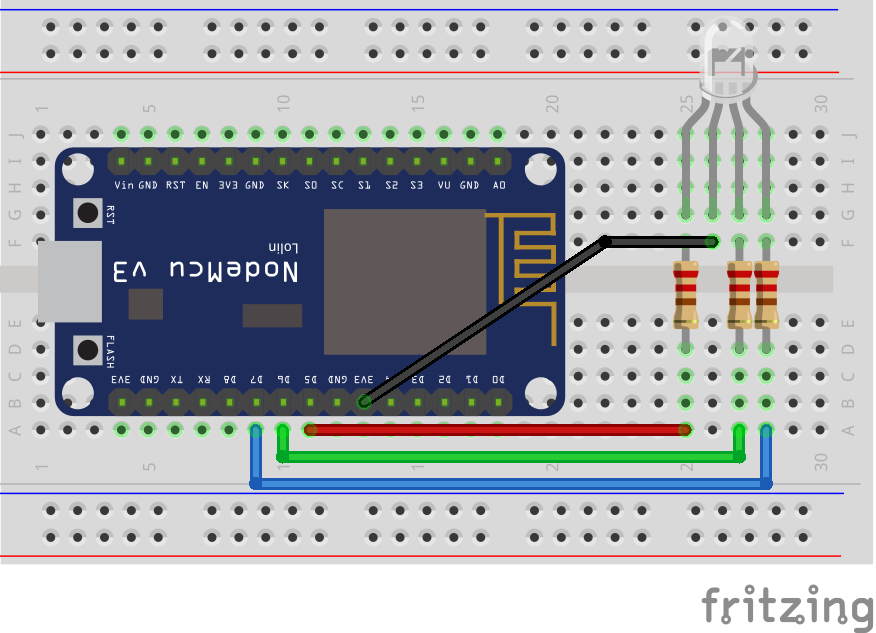

# esp8266-rgb
Contoh penggunaan led RGB di esp8266 amica

Rangkaian dari project dapat dilihat pada gambar di bawah ini

Sementara rangkaian dalam bentuk fritzing dapat diunduh di [esp8266-led-rgb.fzz](esp8266-led-rgb.fzz)

## Tabel skematik
Untuk lebih jelaskan dapat dilihat pada tabel di bawah ini
| ESP8266 Amica | LED RGB                            |
|---------------|------------------------------------|
| D5            | Merah                              |
| D6            | Hijau                              |
| D7            | BIRU                               |
| 3V3           | Pin Annode, Pin panjang            |